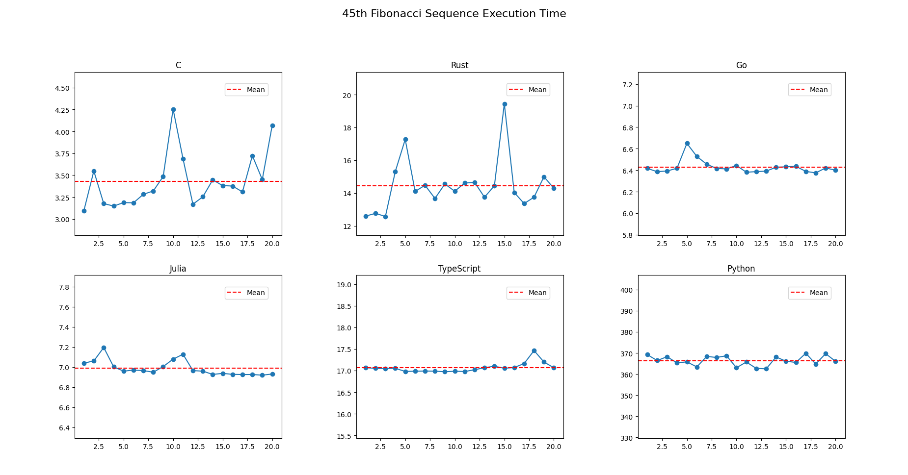

# 📊  Perfer

> A Study of C, Go, Rust, Julia, TypeScript, and Python Performance

## 📝 Overview

This repo houses scripts and resources for a thorough examination of performance characteristics across programming languages including C, Go, Rust, Julia, TypeScript, and Python. Our primary aim is to analyze and compare execution speed and other relevant performance metrics in various scenarios.

## 📂 Contents

1. [**benches**](./benches): This directory contains source code benchmark files written in each of the studied programming languages. Each language has its file/subdirectory within `benches`.

1. [**plots**](./plots): The results obtained from the performance analysis are stored in this directory. It includes data files, charts, and reports summarizing the findings of the study.

## 🛠️ How to Use

1. Fork and clone the repository to your local machine:

	```sh
	git clone https://github.com/your-username/perfer.git
	```

1. Navigate to the repository directory:

	```sh
	cd perfer
	```

1. Explore the source code in the [`benches`](./benches) directory to understand the implementations in each programming language.

1. Run the scripts measure performance metrics.

1. Analyze the results stored in the [`plots`](./plots) directory to understand the performance characteristics of each language.

## 📊 Results

After running the benchmarks and plotting the results, C fib algorithm had the fastest execution times, followed by Rust, Go, Julia, TypeScript, and Python.





## 🤝 Contributing

Contributions to this study are welcome! If you have suggestions for improvements, additional benchmarks, or insights to share, feel free to open an issue or submit a pull request.

## 📜 License

This repository is licensed under the MIT License. See the [LICENSE](LICENSE) file for more information.

---

*Disclaimer: This study aims to offer insights into the performance characteristics of various programming languages and should not be solely relied upon for language selection in real-world projects. The performance of a language may vary depending on numerous factors, such as hardware specifications, compiler optimizations, and specific use cases.*