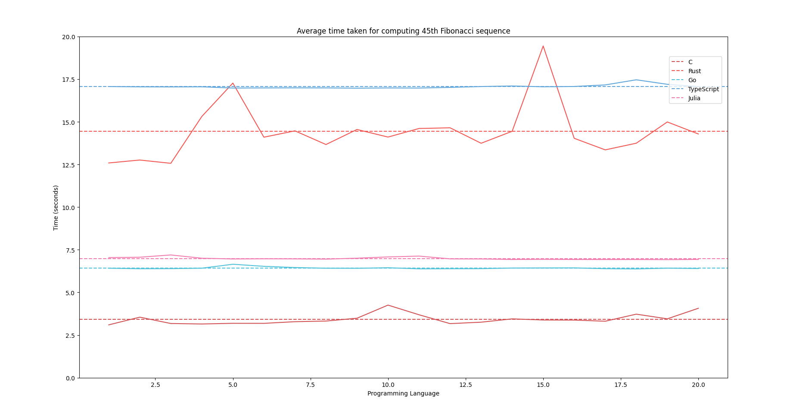
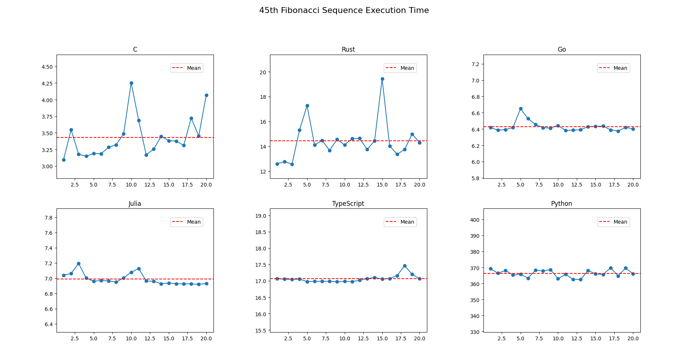
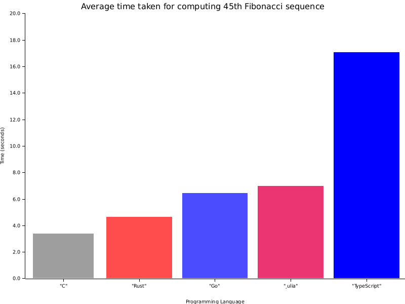

> Plots## Using Matplotlib

If you prefer Matplotlib for plotting, you can install it using pip:

```sh
pip install matplotlib
```

Now, you can run the `plot` and `plot-sep` to visualize the benchmark results:

```sh
python3 plot.py
python3 plot-sep.py
```





## Using Plotters

Alternatively, if you opt for Plotters, navigate to the `plotters` directory and run:

```sh
cargo run --release
```

